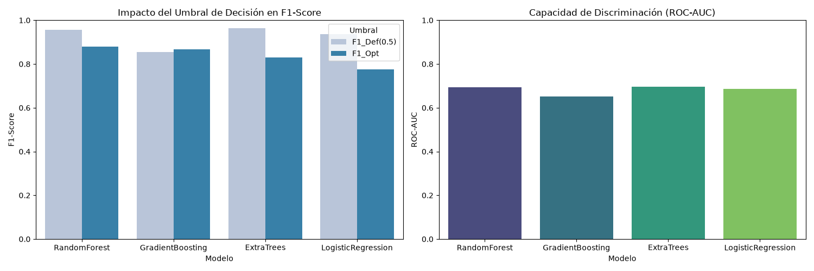

## MODULO 5 - PROYECTO INTEGRADOR (PI): Sistema MLOps de Riesgo Crediticio

Solución integral de Machine Learning orientada a la evaluación automatizada de riesgo crediticio, scoring y predicción de incumplimiento de pagos. El proyecto cubre el ciclo completo de MLOps: desde la exploración y limpieza avanzada de datos, ingeniería de características, entrenamiento y selección de modelos, hasta el despliegue en producción mediante **FastAPI**, contenedores **Docker** y una interfaz de monitoreo continuo de **Data Drift** con **Streamlit**.

#### 📊 **Contexto del Proyecto**
* **Rol:** Junior Advanced Data Scientist.
* **Objetivo de Negocio:** Desarrollar, evaluar y desplegar un modelo predictivo capaz de anticiparse al riesgo de impago (*morosidad*) de nuevos solicitantes de crédito, automatizando la toma de decisiones y garantizando la robustez operativa a través del monitoreo continuo de datos.

Aplicaqueremos y ejecutaremos pipelines automatizados desde la carga de datos, hasta la producción en tiempo real de las predicciones del modelo, a través de aplicaciones/URL como Streamlit, FastAPI y Docker.

------------------------------------------------------------------------------------------------------------------------------

### 💡 Preguntas de Negocio e Insights Clave realizadas durante el EDA
Durante la fase de análisis exploratorio de datos (EDA), se abordaron interrogantes estratégicas para entender los factores determinantes del comportamiento financiero de los clientes:

#### 1. ¿Qué variables demográficas y financieras son los mejores predictores del comportamiento de pago?
* **Puntaje en Datacrédito y Scoring Interno:** Demostraron una correlación alta con la puntualidad del pago, permitiendo segmentar perfiles de alto y bajo riesgo.


* **Relación Ingresos vs. Cuota (Capacidad de Pago):** Los clientes cuyo nivel de cuota compromete más del umbral crítico de su salario presentan una mayor variabilidad en sus fechas de cumplimiento.

#### 2. ¿Cómo impacta la antigüedad laboral y el tipo de empleo en el riesgo crediticio?
* La estabilidad del tipo laboral (independiente vs. empleado) influye directamente en la variabilidad de la mora, siendo clave incorporar este factor en la matriz de decisión.


#### 3. ¿Por qué el negocio debe adoptar este modelo predictivo?
* **Reducción de Cartera Castigada:** Minimiza la tasa de incumplimiento mediante aprobaciones automatizadas basadas en riesgo.
* **Eficiencia Operativa:** Automatiza la evaluación que antes tomaba días, permitiendo decisiones en tiempo real.
* **Monitoreo Proactivo:** Garantiza que el modelo mantenga su precisión mediante la detección continua de cambios en el perfil de los clientes.



### 💵 Recomendaciones de Negocio

* **1. Políticas de Aprobación Diferenciadas por Estabilidad Laboral:** Dado que los trabajadores independientes cuentan con tendencias de ingresos decrecientes y presentan una tasa de mora aproximada de 7.34%, se sugiere implementar bandas de tasas de interés ajustadas al riesgo o requerir codeudores para este segmento específico.

* **2. Monitoreo Dinámico de la Capacidad de Pago:** Se sugiere establecer alertas automáticas cuando la cuota pactada supere por cierto porcentaje (ésto debe de ser pautado por la entidad financiera) el umbral del salario del solicitante, evitando sobreendeudamiento incluso si el puntaje en centrales de riesgo es favorable. También visualizar si cuenta con otros creditos en diferentes entidades y el estado de pago de éstas (si es posible).

* **3. Estrategias de Cobranza Preventiva:** Se sugiere utilizar las probabilidades continuas devueltas por el modelo (probabilidad_buen_pagador o probabilidad_moroso) para identificar clientes en la zona gris, o cerca de sus cortes de pago y desplegar campañas de educación financiera, alertas de cortes o reestructuración antes de que caigan en mora formal.

* **4. Gobierno de Datos y Actualización del Modelo:** Automatizar el pipeline de detección de Data Drift integrado en Streamlit para que sirva como gatillo (trigger) operativo que avise al equipo de analítica cuándo es momento de reentrenar el modelo con datos recientes, evitando la degradación del rendimiento por cambios macroeconómicos. A su vez, visualizar si nuevos datos recaudados pueden ser de utilidad para el modelo. Datos tales como "fecha de ultimo pago" (para visualizar si por una situación externa u fuera del control del cliente lo hace caer como "moroso", por ejemplo, un accidente, etc). 

* **5. Contacto constante y fluido:** Afianzar relaciones entre cliente-entidad financiera, con campañas con entidades comerciales de intereses, generando ofertas atractivas, con mayor recompensa para los clientes que hacen pagos puntuales.

* **6. Datos mas precisos y practicos para el entrenamiento:** Se sugiere datos de mayor peso y relación a los clientes concentrados en la entidad financiera, como, por ejemplo, cuantos servicios tienen con la entidad, cuantos creditos solicitados puede tener un mismo cliente, cuantos han sido pagados a tiempo, cuales son "empresas", "microempresas", "coperativas", trazabilidad de pago (desde cuando se catalogó "moroso" un cliente, o desde cuando ya no realiza el pago), estado migratorio/legal del cliente, entre otros.

-------------------------------------------------------------------------------------------------------------------------

### Construcción EDA (Analisis Exploratorio de los Datos)
El DataSet cuenta con un total de 23 columnas/variables y 10,763 registros.

#### 📖 Diccionario de Variables del Dataset
* **tipo_credito:** Código numérico que identifica la modalidad, tipo o destino del préstamo otorgado.
* **fecha_prestamo:** Marca temporal (fecha y hora) en la que se desembolsó el crédito.
* **capital_prestado:** Monto principal de dinero otorgado al cliente en el préstamo.
* **plazo_meses:** Tiempo total pactado en meses para la devolución completa de la deuda.
* **edad_cliente:** Edad cronológica del titular de la solicitud (en años).
* **tipo_laboral:** Condición u ocupación laboral reportada por el solicitante (ej. Empleado, Independiente).
* **salario_cliente:** Ingreso mensual de fuente laboral reportado por el titular.
* **total_otros_prestamos:** Suma monetaria consolidada de otras obligaciones financieras vigentes.
* **cuota_pactada:** Valor del pago periódico mensual acordado para saldar la deuda.
* **puntaje:** Scoring o calificación interna de riesgo crediticio asignada por la entidad financiera.
* **puntaje_datacredito:** Calificación de riesgo externa generada por la central de información crediticia (Buró).
* **cant_creditosvigentes:** Número total de obligaciones o préstamos activos en el sistema al momento del análisis.
* **huella_consulta:** Cantidad de veces que las entidades financieras han consultado el historial crediticio del cliente en periodos recientes.
* **saldo_mora:** Monto dinerario correspondiente a pagos vencidos y no efectuados a la fecha.
* **saldo_total:** Deuda global pendiente (incluye capital restante, moras e intereses).
* **saldo_principal:** Remanente del capital inicial otorgado que aún no se ha amortizado.
* **saldo_mora_codeudor:** Saldo vencido en obligaciones donde el titular figura como aval o codeudor de un tercero.
* **creditos_sectorFinanciero:** Cantidad de créditos activos contratados con bancos y corporaciones financieras.
* **creditos_sectorCooperativo:** Número de obligaciones vigentes mantenidas con el sector cooperativo.
* **creditos_sectorReal:** Número de productos a crédito con empresas del sector comercial o de servicios.
* **promedio_ingresos_datacredito:** Estimación del ingreso mensual promedio del cliente según registros de centrales de riesgo.
* **tendencia_ingresos:** Indicador cualitativo sobre el comportamiento temporal de los ingresos (ej. Creciente, Estable, Decreciente).
* **Pago_atiempo:** **Variable Objetivo (Target)**. Indica el cumplimiento puntual del plan de pagos (`1` = Pago oportuno, `0` = Incumplimiento o mora).

###3 📋 Caracterización y Estado Actual de los Datos (10,763 Registros)

| Columna | Tipo en Python | Naturaleza Teórica | Estado / Observación |
| :--- | :--- | :--- | :--- |
| **tipo_credito** | `int64` | Categórica (Nominal) | Viene codificada numéricamente. |
| **fecha_prestamo** | `datetime64[us]` | Temporal | Correctamente casteada como fecha. |
| **capital_prestado** | `float64` | Numérica (Continua) | Completa (sin nulos). |
| **plazo_meses** | `int64` | Numérica (Discreta) | Completa (sin nulos). |
| **edad_cliente** | `int64` | Numérica (Discreta) | Completa (sin nulos). |
| **tipo_laboral** | `str` | Categórica (Nominal) | Tipo texto/cadena. |
| **salario_cliente** | `int64` | Numérica (Continua) | Completa (sin nulos). |
| **total_otros_prestamos**| `int64` | Numérica (Continua) | Completa (sin nulos). |
| **cuota_pactada** | `int64` | Numérica (Continua) | Completa (sin nulos). |
| **puntaje** | `float64` | Numérica (Continua) | Score interno completo. |
| **puntaje_datacredito** | `float64` | Numérica (Continua) | Contiene 6 nulos. |
| **cant_creditosvigentes**| `int64` | Numérica (Discreta) | Completa (sin nulos). |
| **huella_consulta** | `int64` | Numérica (Discreta) | Completa (sin nulos). |
| **saldo_mora** | `float64` | Numérica (Continua) | Contiene 156 nulos. |
| **saldo_total** | `float64` | Numérica (Continua) | Contiene 156 nulos. |
| **saldo_principal** | `float64` | Numérica (Continua) | Contiene 405 nulos. |
| **saldo_mora_codeudor** | `float64` | Numérica (Continua) | Contiene 590 nulos. |
| **creditos_sectorFinanciero** | `int64` | Numérica (Discreta) | Completa (sin nulos). |
| **creditos_sectorCooperativo** | `int64` | Numérica (Discreta) | Completa (sin nulos). |
| **creditos_sectorReal**| `int64` | Numérica (Discreta) | Completa (sin nulos). |
| **promedio_ingresos_datacredito** | `float64` | Numérica (Continua) | **Crítica:** Presenta 2,930 nulos (~27%). |
| **tendencia_ingresos** | `object` | Categórica (Ordinal) | **Crítica:** Presenta 2,932 nulos (~27%). |
| **Pago_atiempo** | `int64` | Categórica (Dicotómica) | **Variable Objetivo (Target)**. |


#### 🧹 Limpieza y Tratamiento de Datos

Durante la inspección estadística se identificaron y corrigieron las siguientes anomalías principales para la gestión de las gráficas:

* **Edades incoherentes (`edad_cliente`):** Filtrado de valores atípicos (máximo detectado de 123 años).
* **Scores negativos (`puntaje` / `datacredito`):** Conversión de valores negativos a `NaN` por ser códigos de error del sistema.
* **Salarios extremos (`salario_cliente`):** Tratamiento de outliers astronómicos (hasta $22.000M) para evitar sesgos en el modelo.
* **Asimetría en mora (`saldo_mora`):** Ajuste por alta concentración de ceros (75% sin mora activa).
* **NO SE ENCONTRARON VALORES DUPLICADOS, POR LO QUE NO SE INTREGA EN LA LIMPIEZA DE PREPROCESAMIENTO (PIPELINE)** *

### | 🎯 CONCLUSIÓN EDA | 

#### | 📊 Estado del Dataset y Target (`Pago_atiempo`) |
* | **Desbalance Severo:** 95.25% cumplidos (`1`) vs. 4.75% en mora (`0`). Requiere rebalanceo (`class_weight='balanced'`, SMOTE) y evaluación enfocada en **PR-AUC, Recall y F1-Score**. |
* | **Predictores Clave:** Alta correlación con `puntaje` interno ($r = 0.79$), `puntaje_datacredito` y `edad_cliente`. |
* | **Segmento de Mayor Riesgo:** Independientes con tendencia de ingresos decreciente (7.34% de mora). |

-------------------------------------------------------------------------------------------------------------------------

## 🚀 Guía de Ejecución Local

```bash
# 1. Clonar el repositorio
git clone <https://github.com/Deiberlyn/PI_M5_.git>
cd PI_M5_

# 2. Crear entorno virtual 
python -m venv venv

# 2.1 Activar entorno virtual (En Windows) 
venv\Scripts\activate

# 3. Instalar dependencias
pip install -r requirements.txt

# 3.1 Ejecución o revisión del Análisis Exploratorio de Datos (EDA)
jupyter notebook notebooks/comprension_eda.ipynb

# 4. Gestión de Pipelines
python -m cargar_datos
python -m ft_engineering
python -m model_training_evaluation
python -m model_deploy

# 5. Gestión de aplicaciones para Data Drift (streamlit)
python -m model_monitoring
python -m appstreamlit

-------------------------------------------------------------------------------------------------------------------------

### 🛠️ Pipeline de Cargar Datos (`cargar_datos.py`)

Se realiza pipeline con el fin de levantar los datos del dataset que serán utilizados para la gestión de preprocesamiento, entrenamiento, monitoreo y producción de los modelos de Machine Learning

Creando funciones como `cargarDatos()`, que no solo genera una conexión entre diversos archivos necesarios para realizar el proyecto, sino que implementa un orden estandar por la industria.

-------------------------------------------------------------------------------------------------------------------------

### ⚙️ Pipeline de Preprocesamiento e Ingeniería de Características (`df_engineering.py`)

Se realizó imputaciones de los datos, basandonos en los hallazgos encontrados en el EDA, a través de una arquitectura dinámica y modular basada en **Scikit-Learn (`BaseEstimator`, `TransformerMixin`)**, evitando la fuga de información (*data leakage*) y permitiendo la reutilización del pipeline en diferentes modelos y diferentes pipelines de producción.

Para complementar el modelo y favorecer la predicción de la clase minoritaria (0: No paga), se realizaron la creación de Ratios.

Generamos funciones/librerias internas como `construir_pipeline_preprocesamiento`, para la utomatización de procesos.

1. **`LimpiadorPersonalizado` (Reglas de Negocio y EDA)**
   * **Corrección de Inconsistencias:** Conversión a `NaN` de edades anómalas (`> 90 años`) y puntajes de crédito negativos (`< 0`).
   * **Normalización Categórica:** Limpieza y estandarización de categorías en `tendencia_ingresos` y `tipo_laboral`.
   * **Imputación Segmentada:** Imputación por mediana agrupada por `tipo_laboral` en variables clave (`edad_cliente`, `saldo_total`, `saldo_principal`, `promedio_ingresos_datacredito`).

2. **`GeneradorRatiosFinancieros` (Feature Engineering)**
   * **`ratio_cuota_ingreso`:** Carga financiera mensual (`cuota_pactada / salario_cliente`).
   * **`ratio_mora_saldo`:** Severidad de la mora actual (`saldo_mora / saldo_total`).
   * **`ratio_prestamo_ingreso`:** Nivel de endeudamiento relativo (`capital_prestado / salario_cliente`).
   * **`total_creditos_sectores`:** Agregación de créditos activos en sectores financiero, cooperativo y real.

3. **`PreprocesadorDinamico` (Transformación Numérica y Categórica)**
   * **Detección Automática:** Clasifica automáticamente las columnas presentes en numéricas, nominales y ordinales para evitar errores de ejecución si cambia el subconjunto de variables.
   * **Numéricas:** Imputación por mediana global + escalado estándar (`StandardScaler`).
   * **Nominales:** Imputación por constante (`"Sin_Informacion"`) + codificación One-Hot (`OneHotEncoder`).
   * **Ordinales:** Codificación explícita según jerarquía (`OrdinalEncoder` en `tendencia_ingresos`).

-------------------------------------------------------------------------------------------------------------------------

### 🧩 Pipeline de Ensamblado - Entrenamiento, Evaluación y Selección de Modelos (`model_training_evaluation.py`)

Se realizó la integración de los pipelines `cargar_datos.py`, con la función `cargarDatos`, y de preprocesamiento `df_engineering.py` Se diseñó una arquitectura de evaluación rigurosa enfocada en la detección efectiva de la clase minoritaria (clientes morosos), mitigando el *Data Leakage* y previniendo métricas infladas artificialmente.

1. 🚨 Control de Data Leakage y Selección de Variables
Previo al entrenamiento, se eliminaron del conjunto de características variables críticas identificadas en el EDA:
* **`puntaje`:** Removido por *Data Leakage* (variable post-evento calculada tras el pago, con correlación de 0.79).
* **`cant_creditosvigentes` y `saldo_principal`:** Removidas por alta redundancia y multicolinealidad con el desglose por sectores y el `saldo_total`.
* **`fecha_prestamo`:** Removida al no ser relevante en modelos tabulares no temporales. Adicional, en el DataSet no hay una columna que relacione el tiempo de un credito vs su irregularidad/falta de pago. 

2. ⚖️ Estrategia de Balanceo y Evaluación Integrada

- **Submuestreo Estratégico (Random Undersampling):**
   * Aplicado **únicamente sobre el conjunto de entrenamiento** (`sampling_strategy=0.5`), ajustando la proporción a 1 cliente moroso por cada 2 pagadores para evitar distorsionar el set de evaluación (*Test*) y contar con un modelo que no prediga por "flojera" la clase mas elevada.

- **Optimización Dinámica de Umbrales:**
   * En lugar de asumir un punto de corte por defecto ($0.5$), se optimizó el umbral de decisión utilizando la curva **Precision-Recall** para maximizar el F1-Score en la detección de incumplimiento.

- **Métricas de Desempeño Evaluadas:**
   * **Performance:** ROC-AUC, Precision, F1-Score y Recall específico para la clase minoritaria (0: Morosos).
   * **Consistencia:** *Overfit Gap* (diferencia entre métricas de entrenamiento y prueba).
   * **Escalabilidad:** Tiempos de entrenamiento (seg) e inferencia (ms/muestra).

3. 🤖 Modelos Evaluados y Resultados

Se evaluaron cuatro algoritmos baseline: **RandomForest**, **ExtraTrees**, **LogisticRegression** y **GradientBoosting**. 

* **Impacto del Umbral y Balanceo:** La combinación de *Undersampling* (2:1) con la optimización de umbral incrementó drásticamente la capacidad de identificar morosos, pasando de un Recall marginal del **7.8%** a un **62.7% en Regresión Logística** y un **58.8% en Random Forest**.
* **Visualización:** El script genera y guarda automáticamente el reporte gráfico `comparativa_modelos.png` mostrando la capacidad de discriminación (ROC-AUC) y el impacto del umbral optimizado.

#### 🏆 Selección del Modelo Ganador: ExtraTrees Classifier

Si bien la Regresión Logística presenta métricas lineales competitivas, se ha seleccionado **ExtraTrees Classifier** como el modelo definitivo para producción debido a su robustez arquitectónica y capacidad de adaptación a largo plazo.

#### 💡 Justificación Técnica y de Negocio

1. **Captura de Relaciones No Lineales e Interacciones Complejas:**  
   A diferencia de los modelos lineales, ExtraTrees evalúa subconjuntos de características aleatorias y cortes no lineales, lo que le permite entender patrones de riesgo complejos entre múltiples variables financieras simultáneamente.

2. **Capacidad de Generalización a Futuro (Resiliencia al Data Drift):**  
   Al ser un modelo de ensamble basado en árboles extremadamente aleatorizados, ofrece una mayor flexibilidad frente a cambios en la distribución de los datos de entrada (*Data Drift*) a lo largo del tiempo, garantizando una mayor vida útil en producción antes de requerir un reentrenamiento.

3. **Excelente Balance de Métricas:**  
   * **Recall Morosos:** `57.84%` (Captura una porción significativa del riesgo real).
   * **Capacidad de Discriminación (ROC-AUC):** `0.6973` (Supera a Regresión Logística y Gradient Boosting en la separación de clases).
   * **Precision Optimizado:** `97.18%` (Mantiene una tasa sumamente baja de falsos positivos).

--------------------------------------------------------------------------------------------------------------------------

### ✅ Pipeline de Automatización y Despliegue - predicción en tiempo real (`model_deploy.py`)

#### 🚨Endpoint desarrollado con **FastAPI** para automatizar el scoring crediticio y la evaluación de riesgo de clientes de forma individual o por lotes (*batch*).

### Características Principales

* **Arquitectura del Endpoint (`/predict`):** Recibe datos de entrada en formato JSON (`List[Dict[str, Any]]`), los procesa mediante un `DataFrame` de Pandas y aplica el pipeline de preprocesamiento serializado.
* **Prevención de Data Leakage:** Elimina de manera estricta columnas sensibles o filtradas antes de la transformación (`puntaje`, `fecha_prestamo`, `cant_creditosvigentes`, `saldo_principal` y `Pago_atiempo`).
* **Modelo Predictivo:** Carga artefactos entrenados (`modelo_ganador.pkl` y pipeline de preprocesamiento `construir_pipeline_preprocesamiento.pkl` ) con soporte para ejecución local y contenedores Docker.
* **Umbral de Decisión Personalizado:** Evalúa la probabilidad de buen pagador utilizando un umbral de decisión ajustado en `0.6553` para clasificar las solicitudes en **Aprobado** o **Rechazado** según fue entrenado el modelo en model_training_evaluation.py.
* **Salida Estructurada:** Retorna un JSON con el ID del registro, la probabilidad calculada a 4 decimales, la clase binaria y la etiqueta descriptiva del crédito. Mateniendo un mensaje claro entre clientes que son calificados como "morosos" o clientes que si son considerados "buenos pagadores".


#### Docker Container - Generación de Imagen e ID

* **Practicidad y Organización:** Se realiza la creación del archivo base "Dockerfile con la información necesaria para la creación del contenedor del modelo y el script de nuestra API, manteniendo como puerto (localhost) 8000, según el estandar de la industria.
* **Prevención de Carga de Datos Innecesarios:** Se crea un script .txt (`requirements-docker.txt`).únicamente para Docker, ya que este contiene las librerias para el modelo y pipeline de preprocesamiento. Se evita cargar el archivo general requirements.txt, debido a qué éste contiene TODAS las librerias del proyecto, información NO necesaria para Docker correr el modelo.
* **Definición de Parámetros:** Como se espera en la instrustria, se crea el archivo .dockerignore, con el fin de evitar cargar dentro del contenedor datos u archivos residuales de Python al momento de entrenar, crear y automatizar modelos de Machine Learning, información que no necesita Docker para correr el script y realizar predicciones con el modelo.

--------------------------------------------------------------------------------------------------------------------------

### 🗂️ Pipelines de desarrollos del proyecto (`model_monitoring.py | appstreamlit.py` )

### Módulo de Monitoreo y Detección de Data Drift (`appstreamlit.py`)

Herramienta analítica y de visualización interactiva construida con **Streamlit** y pruebas estadísticas para evaluar continuamente cambios en las distribuciones de los datos entre el entorno histórico (referencia) y nuevos lotes de datos simulados (`Base_de_datos_con_Data_Drift_Simulado.xlsx`). El script se completo junto con el pipeline `model_monitoring.py`

### Características Principales (`model_monitoring`)

* **Monitoreo Estadístico Automatizado:** 
  * Emplea la prueba **Kolmogorov-Smirnov (KS)** y el **Population Stability Index (PSI)** para evaluar variables numéricas.
  * Utiliza la prueba de independencia **Chi-cuadrado** para variables categóricas.
* **Sistema de Semáforos y Alertas:** Clasifica automáticamente cada variable evaluada en estados de **ESTABLE**, **ADVERTENCIA** o **CRÍTICO** en función de los umbrales de desviación calculados (`alpha=0.05`, `PSI >= 0.2`).
* **Dashboard Interactivo en Streamlit:**
  * Métricas globales en tiempo real con tarjetas de resumen (*Total de variables monitoreadas*, *Variables estables* y *Variables críticas*).
  * Tabla de reporte estilizada mediante formato condicional.
  * Gráficas comparativas de distribución dinámicas (histogramas superpuestos para variables numéricas y barras agrupadas para categóricas vía Plotly).
* **Análisis Temporal:** Evalúa la evolución y el volumen de registros a lo largo del tiempo utilizando la columna `fecha_prestamo`.
* **Recomendaciones Inteligentes:** Genera alertas automáticas sugiriendo acciones de reentrenamiento (*retraining*) en caso de detectar anomalías críticas de *Data Drift*.

--------------------------------------------------------------------------------------------------------------------------

### Otros Documentos/Archivos de soporte para el proyecto

* **Creación de carpetas:** Se genera la carpeta `images`, donde se comparten las graficas más relevantes del EDA y el estudio de los modelos entrenados.
* **Bases de datos:** Para este proyecto se utilzó la Base_de_datos.xlsx como base para todos los script y entrenamientos de los modelos. Con excepción de `model_monitoring.py`, script (con fines educativos) enfocado para visualizar si contamos con Data Drift (actualización de datos), lo que determina si un modelo debe de ser reentrenado o no.

--------------------------------------------------------------------------------------------------------------------------